**RabbitMall项目地址**：[github 地址](https://github.com/SSDWGG/rabbitMall.git)

# RabbitMall

### 前言

前台使用 vue技术 为基础开发  （axios，vue-router，vuex）
服务端 使用 springboot 来启服务


项目启动方式：
在 mysql 数据库中建立数据库，导入sql 文件
sever 中配置一下链接数据库
mall/network/request中链接接口
服务端启动 ：从FinalprojectApplication 文件夹 启动
前端启动 ：  使用 npm install 安装依赖   使用 npm start 启动


系统默认用户账号已经给出 （或者可以自行注册）
系统管理员账号默认为（rywtest      qwe12345）

<br/>

### 1.项目截图
客户端截图
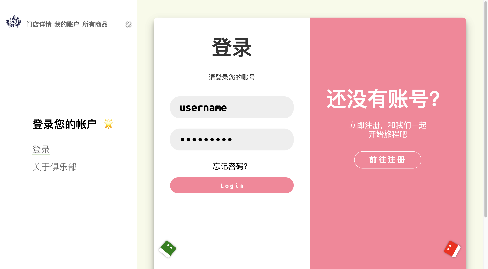
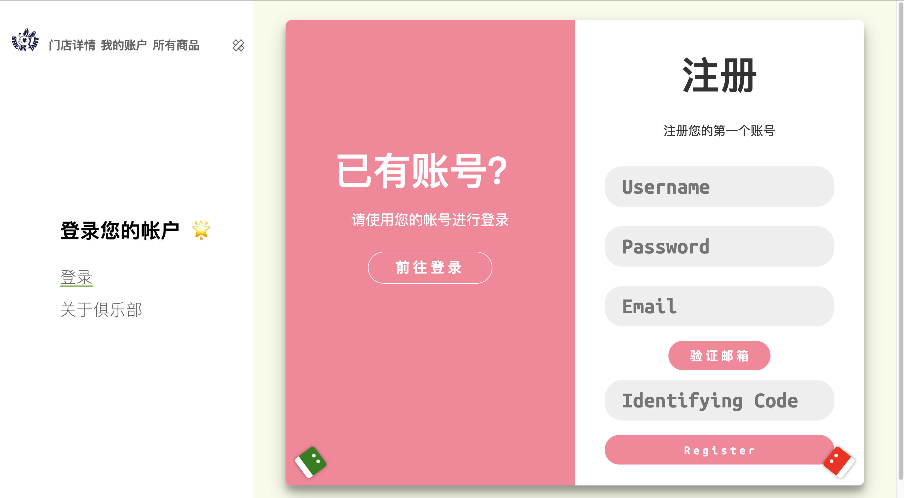
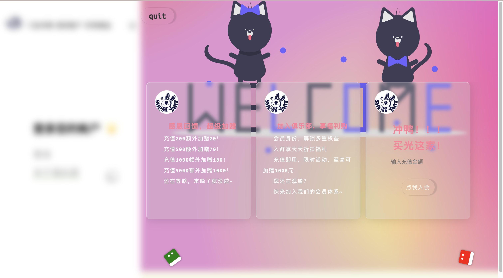
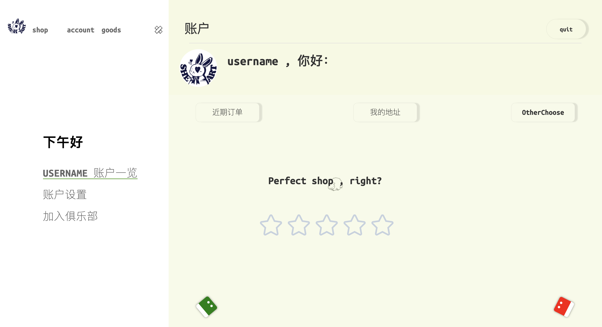


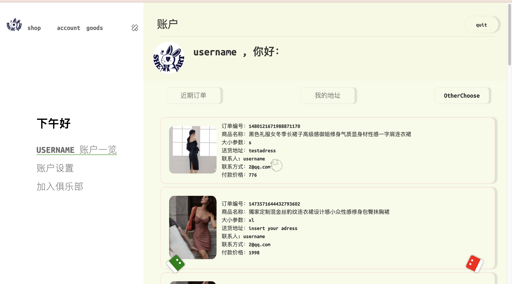


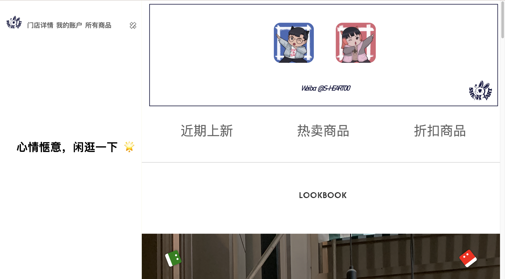

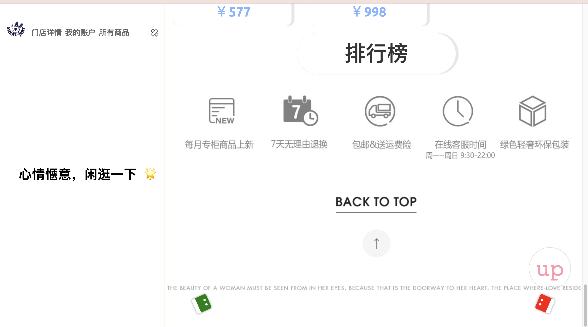
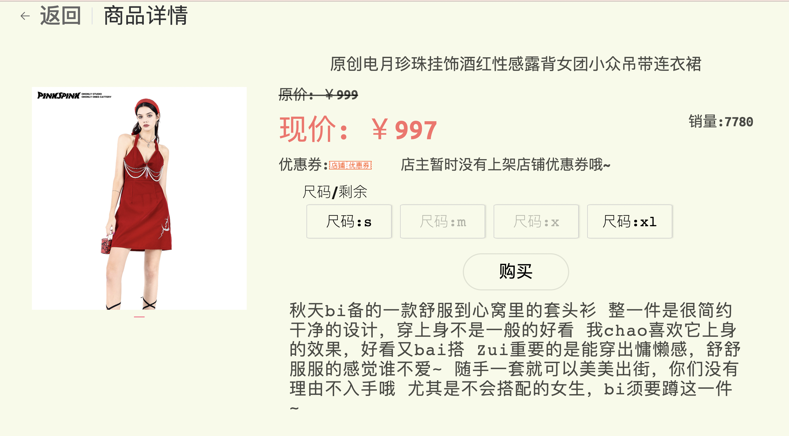
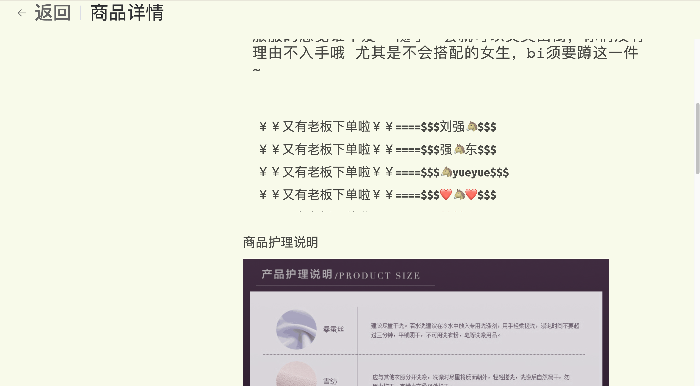
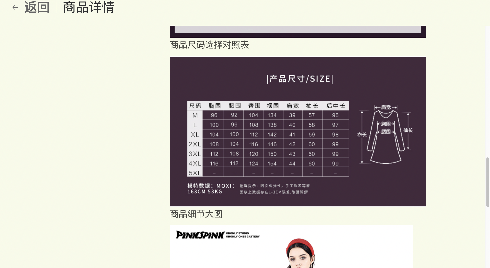
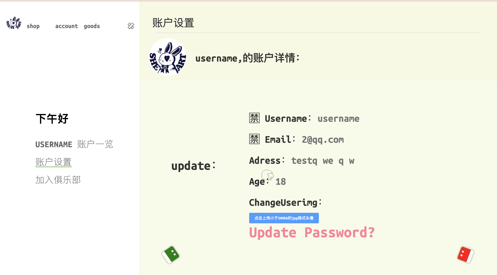

管理员端截图（图片不一一展示，基本都是同类型的表）
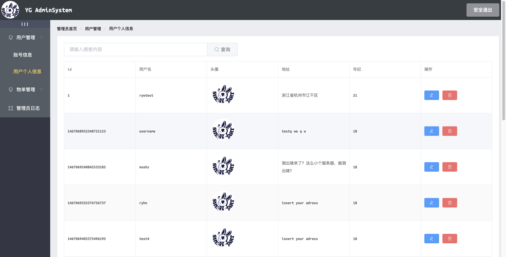

项目的类图，用例图，ER图，各部分时序图等图较多，全都放在图片文件夹中

<br/>

### 2.项目页面和功能

页面：
<br/>
    前台：
- [x] 首页页面
- [x] 分类商品页面
- [x] 店铺介绍页面
- [x] 详细商品信息页面
- [x] 购物金充值页面
- [x] 用户个人页面等页面
<br/>
    后台:
- [x] 管理账号页面
- [x] 管理用户信息页面
- [x] 管理订单页面
- [x] 管理货物页面
- [x] 查看管理员日志页面

功能：
<br/>
    前台功能
- [x] 用户浏览商品功能
- [x] 用户下单商品功能
- [x] 充值功能
- [x] 修改用户信息功能。
- [x] 搜索查询功能
<br/>
    管理端功能：
- [x] 增删改查用户账户和用户信息功能
- [x] 增删改查订单货物功能
- [x] 条件搜索展示管理员行为操作日志功能。

<br/>


### 2.打包部署
项目打包使用 npm build 命令
项目部署的话 将dist文件夹直接部署到路径的根目录下（这样会减少很多新手不必要的麻烦）

将dist文件包放在/home/www文件夹下
在nginx中配置如下
```javascript
  server {
        listen       *  default_server;
        server_name  _;
        root        /home/www/dist;
        # Load configuration files for the default server block.
        include /etc/nginx/default.d/*.conf;
        location / {
                #资源访问失败后定向到index.html
            try_files $uri $uri/ /index.html;
        }    
    }
```

**项目预览地址**：[预览地址](http://ssdwgg.xyz)
<br/>