# RabbitMall

### 三端预览地址

| 部署端点 | 地址 |
|---------|------|
| VPS HTTPS | [https://mall.ssdwgg.site](https://mall.ssdwgg.site) |
| VPS HTTP (备用) | [http://mall.aiwgg.cn](http://mall.aiwgg.cn) |
| GitHub Pages | [https://ssdwgg.github.io/rabbitMall](https://ssdwgg.github.io/rabbitMall) |

**GitHub 仓库**：[https://github.com/SSDWGG/rabbitMall](https://github.com/SSDWGG/rabbitMall)

> CI/CD：`git push origin main` 后 GitHub Actions 自动构建并部署到 VPS 和 GitHub Pages。

### 前言

前台使用 vue技术 为基础开发  （axios，vue-router，vuex）
服务端 使用 springboot 来启服务


项目启动方式：(node 版本14.x)
在 mysql 数据库中建立数据库，导入sql 文件
sever 中配置一下链接数据库
mall/network/request中链接接口
服务端启动 ：从FinalprojectApplication 文件夹 启动
前端启动 ：  使用 npm install 安装依赖   使用 npm start 启动

> 使用 Node 17+ 需设置环境变量：`NODE_OPTIONS=--openssl-legacy-provider`

系统默认用户账号已经给出 （或者可以自行注册）
系统管理员账号默认为（rywtest      qwe12345）


想要使用邮箱功能需要如图进行后端配置（具体参数需要去qq邮箱申请，步骤请百度，或者联系我）
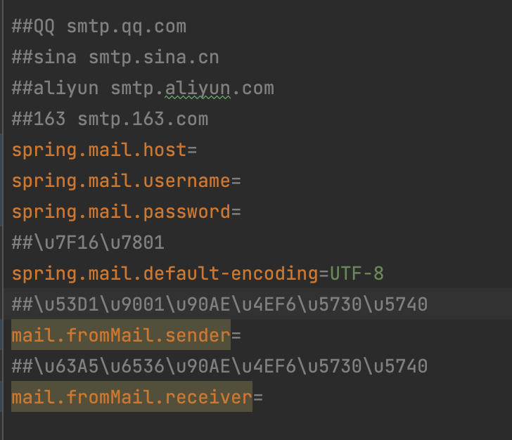

项目启动有任何问题也可以联系我~
<br/>

### 1.项目截图
客户端截图
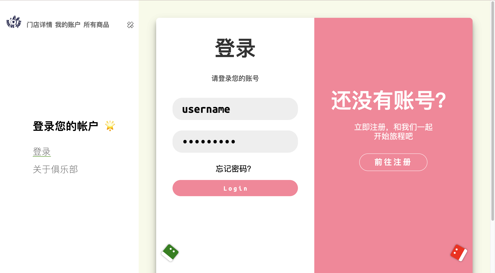
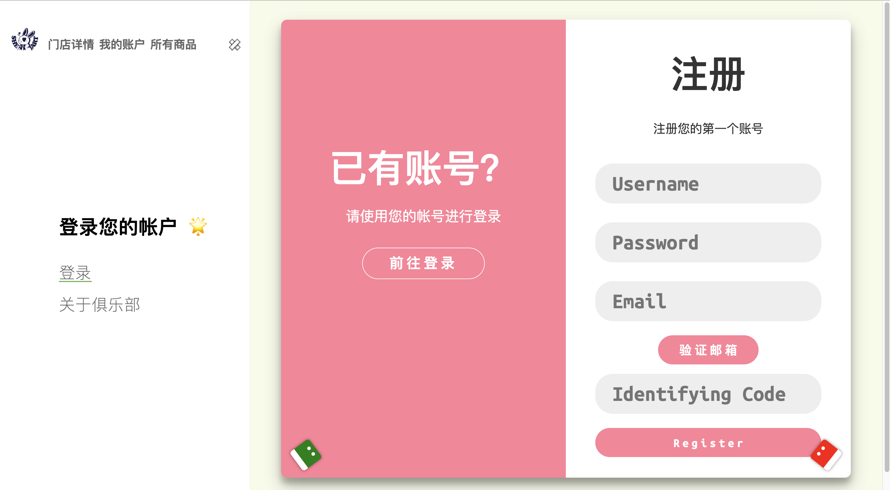
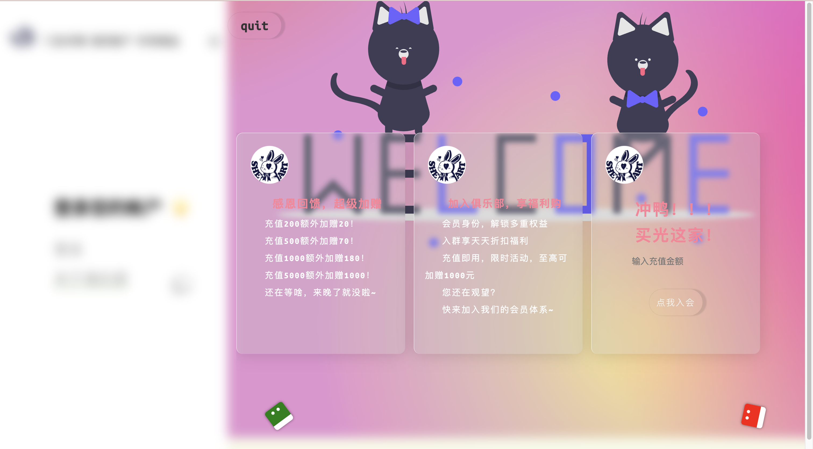
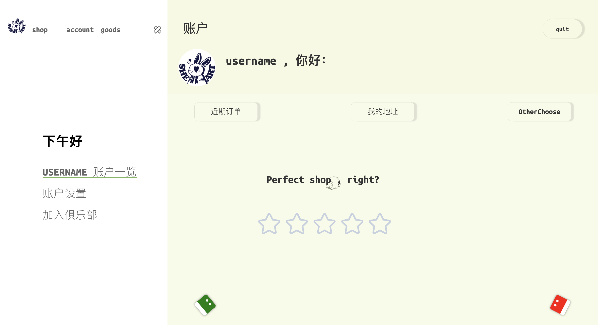

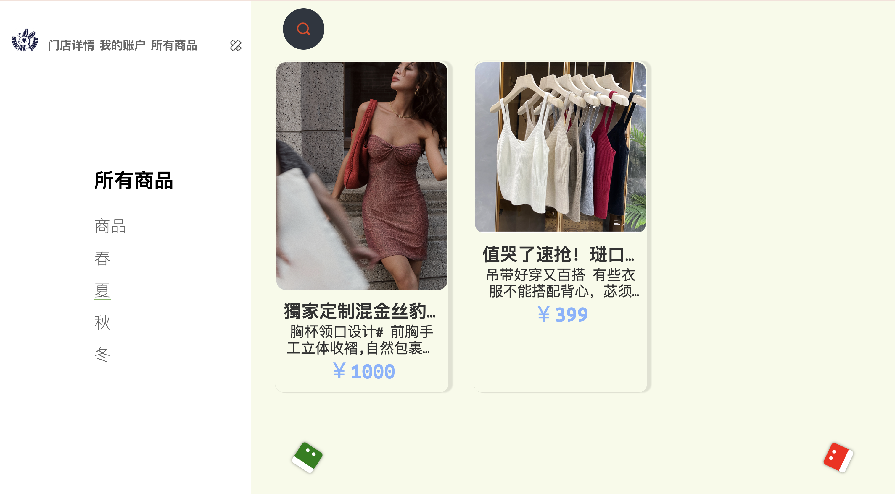
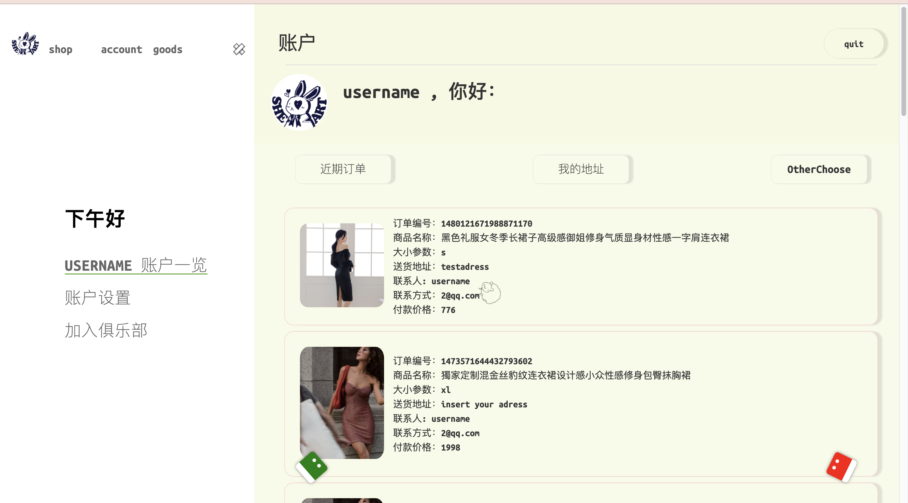

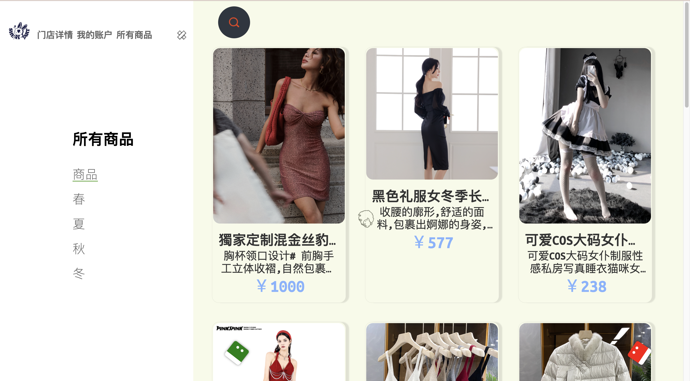
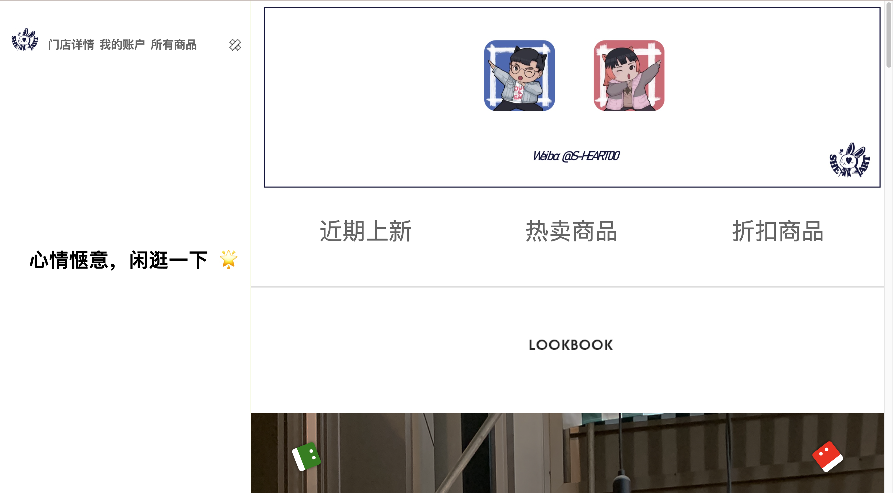
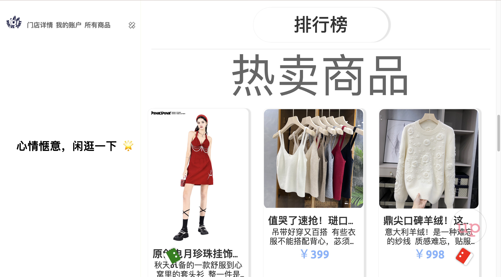
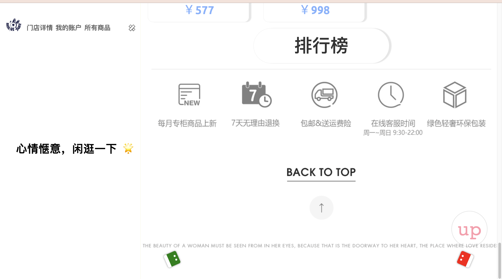
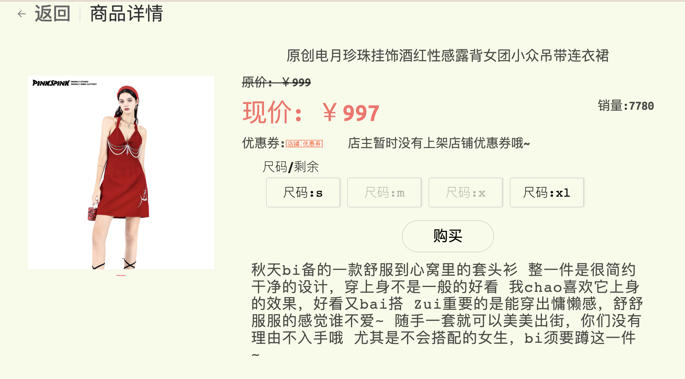
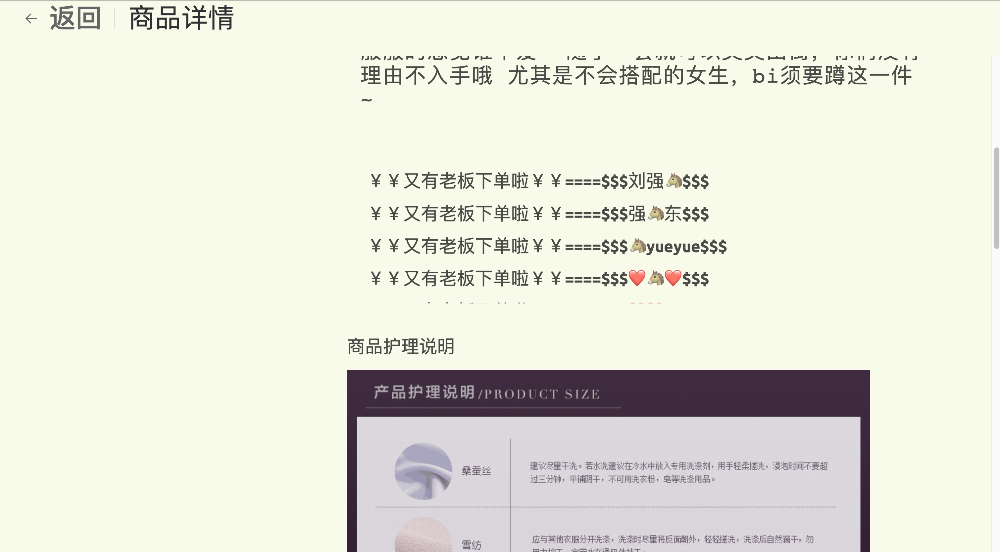
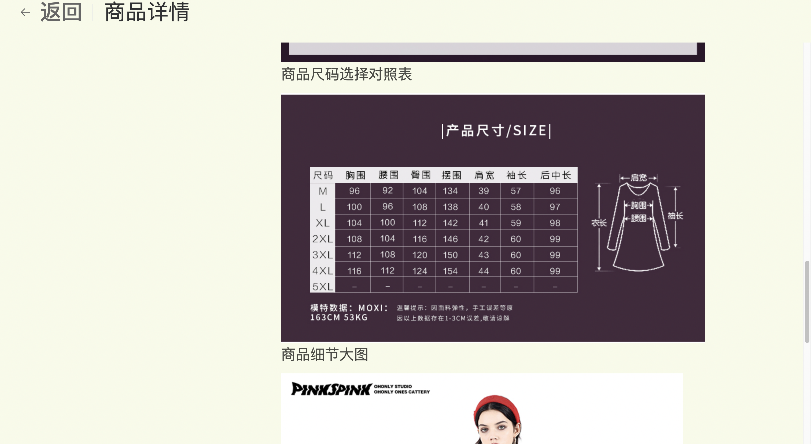
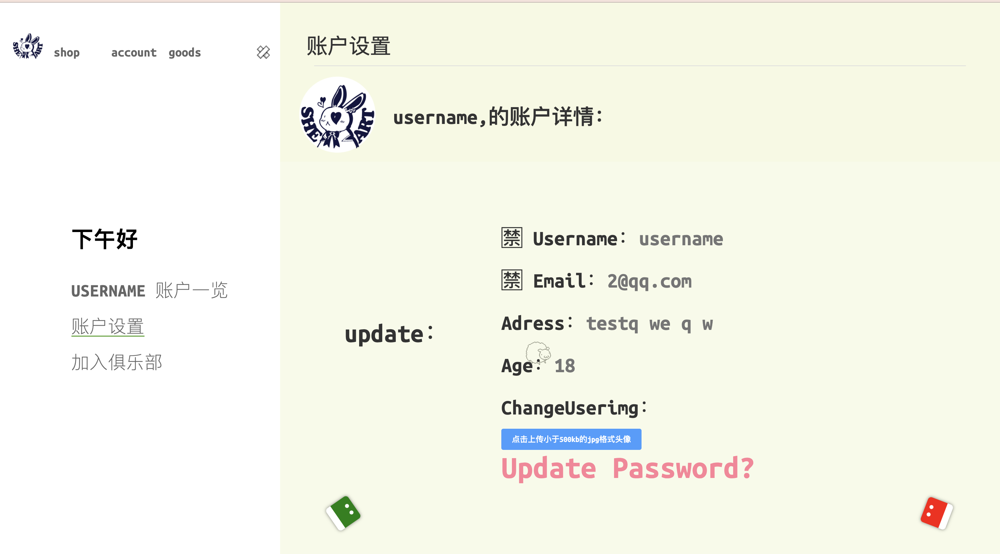

管理员端截图（图片不一一展示，基本都是同类型的表）
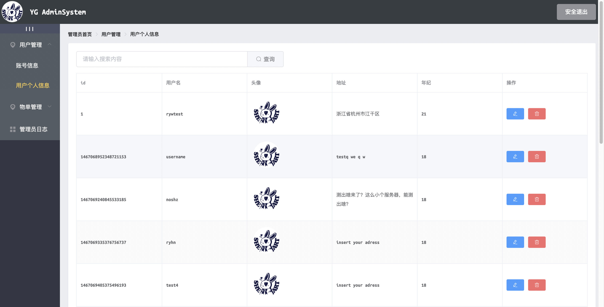

项目的类图，用例图，ER图，各部分时序图等图较多，全都放在图片文件夹中

<br/>

### 2.项目页面和功能

页面：
<br/>
    前台：
- [x] 首页页面
- [x] 分类商品页面
- [x] 店铺介绍页面
- [x] 详细商品信息页面
- [x] 购物金充值页面
- [x] 用户个人页面等页面
<br/>
    后台:
- [x] 管理账号页面
- [x] 管理用户信息页面
- [x] 管理订单页面
- [x] 管理货物页面
- [x] 查看管理员日志页面

功能：
<br/>
    前台功能
- [x] 用户浏览商品功能
- [x] 用户下单商品功能
- [x] 充值功能
- [x] 修改用户信息功能。
- [x] 搜索查询功能
<br/>
    管理端功能：
- [x] 增删改查用户账户和用户信息功能
- [x] 增删改查订单货物功能
- [x] 条件搜索展示管理员行为操作日志功能。

<br/>


### 2.打包部署

项目使用 `npm run build` 打包（Node 17+ 需要 `NODE_OPTIONS=--openssl-legacy-provider`）。

部署服务器：124.223.119.218，部署路径：`/www/wwwroot/ryw-yun-project/mall/`

CI/CD 自动化：推送到 main 分支后，GitHub Actions 自动执行：
- VPS 部署（rsync + chown www:www）
- GitHub Pages 部署（publicPath=/rabbitMall/，含 404.html SPA fallback）

Nginx 配置要点：
```nginx
server {
    listen 443 ssl http2;
    server_name mall.ssdwgg.site;
    root /www/wwwroot/ryw-yun-project/mall;
    index index.html;

    ssl_certificate     /etc/letsencrypt/live/mall.ssdwgg.site/fullchain.pem;
    ssl_certificate_key /etc/letsencrypt/live/mall.ssdwgg.site/privkey.pem;

    location / {
        try_files $uri $uri/ /index.html;
    }
}
```
<br/>